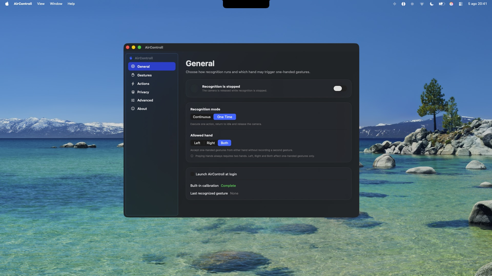
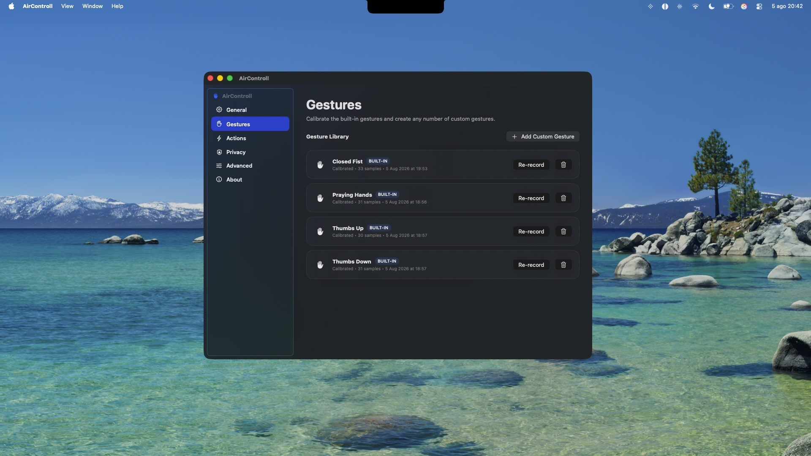

<p align="center">
  
</p>

<h1 align="center">AirControll</h1>

<p align="center">
  <strong>Control your Mac using fully offline hand gestures.</strong>
</p>

<p align="center">
AirControll is a native macOS application that lets you control media playback, system features, applications and keyboard shortcuts using customizable hand gestures powered entirely by Apple's Vision framework. Everything is processed locally on your Mac with no cloud services, analytics or internet connection required.
</p>

<p align="center">
  
  
  
  
</p>

---

# Screenshots

<p align="center">
  
</p>

<p align="center">
  
</p>

<p align="center">
  
</p>

<p align="center">
  
</p>

---

AirControll transforms your camera into a completely local gesture recognition system that allows you to interact with macOS naturally without touching the keyboard or trackpad.

Built using Apple's Vision framework and AVFoundation, every camera frame is processed entirely in memory and discarded immediately after analysis. No images are stored, transmitted or uploaded.

Designed as a lightweight native macOS menu bar application, AirControll integrates seamlessly with the operating system while remaining private, responsive and fully offline.

---

## Features

- Native AppKit + SwiftUI application
- Fully offline hand gesture recognition
- Apple Vision hand pose detection
- Unlimited custom gestures
- Built-in gesture calibration
- Continuous and One-Time recognition modes
- Left, Right or Both hand recognition
- Stable multi-sample gesture recording
- Variance-aware gesture matching
- Temporal stability filtering
- Cooldown and duplicate trigger prevention
- Media playback control
- Volume control
- Brightness control
- Mission Control
- Show Desktop
- Lock Screen
- Screenshot
- Launch Applications
- Custom keyboard shortcuts
- Security-scoped bookmarks
- Accessibility permission validation
- Camera permission validation
- Local configuration storage
- No cloud services
- No analytics
- No telemetry
- No internet connection required
- Privacy-first architecture

---

## Built-in Gestures

AirControll includes four built-in gestures that must be calibrated before recognition can be enabled.

- Closed Fist
- Praying Hands
- Thumbs Up
- Thumbs Down

You can also create an unlimited number of custom gestures and assign any supported action to each one.

---

## Supported Actions

- Play / Pause
- Next Track
- Previous Track
- Volume Up
- Volume Down
- Mute
- Brightness Up
- Brightness Down
- Mission Control
- Show Desktop
- Lock Screen
- Screenshot
- Open Application
- Keyboard Shortcut
- Do Nothing

---

## Installation

Download the latest release from the **Releases** page.

1. Open the DMG.
2. Drag **AirControll.app** into the **Applications** folder.
3. Launch AirControll.
4. Grant Camera permission.
5. Grant Accessibility permission.
6. Calibrate the four built-in gestures.
7. Assign actions.
8. Enable gesture recognition.

---

## Requirements

- macOS 13 Ventura or later
- Apple Silicon or Intel
- Built-in or external camera
- Accessibility permission
- Camera permission

---

## Privacy

AirControll has been designed with privacy as a core principle.

Camera frames are processed locally in memory using Apple's Vision framework and are immediately discarded after recognition.

No camera images are stored on disk.

No recordings are created.

No frames leave your Mac.

No cloud services are used.

### AirControll does **NOT** collect:

- Analytics
- Telemetry
- Crash reporting
- Usage statistics
- Tracking identifiers
- Personal information
- Network traffic

All gesture templates are stored locally inside:

```
~/Library/Application Support/AirControll/
```

Only normalized numerical gesture features are stored.

---

## Built With

- Swift 6
- Swift Package Manager
- SwiftUI
- AppKit
- AVFoundation
- Vision
- CoreGraphics
- ApplicationServices

---

## Roadmap

- [ ] Gesture sensitivity profiles
- [ ] Per-application gesture mappings
- [ ] Multiple action chains
- [ ] Gesture import and export
- [ ] Apple Shortcuts integration
- [ ] Siri integration
- [ ] Apple Watch companion
- [ ] Multi-camera support
- [ ] iCloud settings synchronization

---

## Contributing

Contributions are welcome.

If you discover a bug or have an idea for an improvement, please open an Issue or submit a Pull Request.

Please discuss major changes before starting work.

---

## License

Copyright © 2026 Argyrios.

Licensed under the Mozilla Public License 2.0.

See the LICENSE file for additional information.
